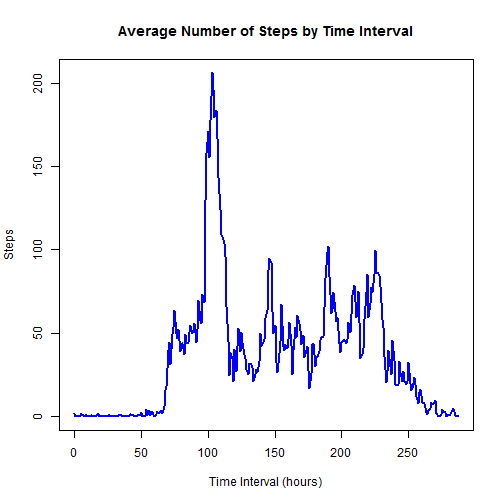

Analysis of Personal Movement Data
===================================

The data in this report is derived from an unnamed individual's movement as tracked by a personal movement device.  The data is contained in the .csv file "activity".  It consists of data collected at 5 minute intervals over a two month period. The data measures number of steps by day and five minute interval during the day

Firstly we read the data, calculate the daily mean and median for the data and produce a histogram of activity by day.


```r
## Load data

data <- read.csv("activity.csv")

##mean

mean <- 24*12*mean(data$steps,na.rm=T)

##plot total number of steps per day

data$date <- unclass(as.Date(data$date,format="%Y-%m-%d"))  ## Change Date to datetime format
id=15614:15674
a <- numeric()
for(i in id){
        dataseg <- data[,2]==i
        dataseg1 <- data[dataseg,]
        a1 <- sum(dataseg1$steps,na.rm=T)
        a <- append(a,a1)
        }
##median

median <- median(a)
y <- seq(as.Date("2012/10/01"), as.Date("2012/11/30"), by="day")
hist <- data.frame(cbind(y,a))
plot(y,a,type="h",xlab="Date",ylab="Steps",main="Number of Steps by Day",col="red",lwd=8)
```

 

The mean of the data is 1.0766 &times; 10<sup>4</sup> and the median is 1.0395 &times; 10<sup>4</sup>.  The data shows that October and November appear to be more active than November but there are many missing values and "0"s returned.

The plot of acivity over an average day shows that activity peaks in the morning.


```r
##plot average number of steps by time interval and max val

data <- read.csv("activity.csv")
id=seq(from=0,to=2355,by=5)
x <- numeric()
x2 <- numeric()
for(i in id){
        dataseg <- data[,3]==i
        dataseg1 <- data[dataseg,]
        x1 <- mean(dataseg1$steps,na.rm=T)
        x3 <- sum(dataseg1$steps,na.rm=T)
        x <- append(x,x1)
        x2 <- append(x2,x3)
}
p <- is.nan(x)
x <- x[!p]
u <- 0:(length(x)-1)
hist <- data.frame(cbind(u,x))
plot(u,x,type="l",xlab="Time Interval (hours)",ylab="Steps",main="Average Number of Steps by Time Interval",col="blue",lwd=2)
```

 

```r
maxsegments <- hist[,2]==max(x)
maxsegments1 <- hist[maxsegments,]
maximumInterval <- maxsegments1[[1]]
```

The peak 5 minute period is the103th in the day.
To compute the number of missing values


```r
##Calculating number of missing values

data <- read.csv("activity.csv")
complete <- complete.cases(data)
NAcases <- data[!complete,]
numberNA <- nrow(NAcases)
```

The number of missing values is 2304

The missing values are replaced by the average number of steps in a five minute interval for the day.


```r
data <- read.csv("activity.csv")
data$date <- unclass(as.Date(data$date,format="%Y-%m-%d"))

id=15614:15674
adjdata <- data.frame(steps=numeric(),date=as.Date(character()),interval=numeric())
for(i in id){
        dataseg <- data[,2]==i
        dataseg1 <- data[dataseg,]
        t <- i-15613
        b <- a[[t]]/288
        dataseg1[is.na(dataseg1)] <- b
        adjdata <- rbind(adjdata,dataseg1)             
        
}
adjdata$date <- as.Date(adjdata$date,origin="1970-01-01")
Daysweek <- weekdays(adjdata$date)
Daysweek1 <- cbind(adjdata,Daysweek)
```
The next step is to plot the number of steps by day having added back the average values where missing


```r
newmean <- 24*12*mean(Daysweek1$steps,na.rm=T)
Daysweek1$date <- unclass(as.Date(Daysweek1$date,format="%Y-%m-%d"))  ## Change Date to datetime format
id=15614:15674
v <- numeric()
for(i in id){
        Daysweek1seg <- Daysweek1[,2]==i
        Daysweek1seg1 <- Daysweek1[Daysweek1seg,]
        v1 <- sum(Daysweek1seg1$steps,na.rm=T)
        v <- append(v,v1)
}
newmedian <- median(v)
w <- seq(as.Date("2012/10/01"), as.Date("2012/11/30"), by="day")
hist <- data.frame(cbind(w,v))
plot(w,v,type="h",xlab="Date",ylab="Steps",main="Number of Steps by Day (Adjusted)",col="black",lwd=8)
```

 

The new mean is 9354.2295 and the new median is 1.0395 &times; 10<sup>4</sup>.  The newmedian is unchanged from the original median because of the method used to replace the missing values but the mean is lower

